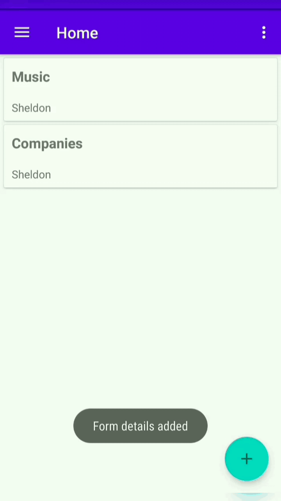

## FormCreator

Use FormCreator to easily Create custom forms, Distribute them to other app users and Record Responses in a CSV format.


### Installation
Clone this repository and import into **Android Studio**
```bash
git clone https://github.com/sheldonr15/FormCreator.git
``` 

</br>


### :pushpin: **Overview of App** : 

| [Login and Sign Up](#login-and-sign-up) | [Making Forms](#making-forms) | 
| --- | --- |
||| 

</br>

| [View - Delete - Download Results](#view-/-delete-/-download-results) |
| :--: |
||

</br>


### Making Forms
- Similar to bullet points / radio buttons, checkboxes and the fields can also be added.
- User can select date range in which the form must be visible.
- On Clicking **Submit**, your form becomes available to other users.


</br>

### Login and Sign Up
- Data stored and verified using SQLite.

</br>

### View / Delete / Download Results.
- User can view his/her forms on the **Profile** section.
- Deleting forms removes the forms from other users view too.
- Downloading results stores the result in CSV format in the local storage.

